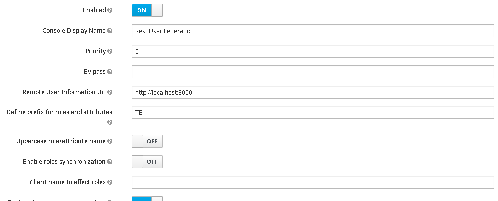
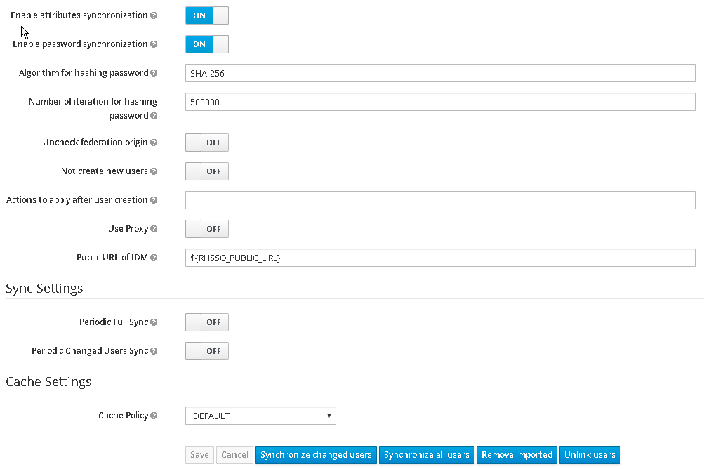

# RH-SSO federation

RH-SSO federation to synchronize users from **business REST API** to RH-SSO. 

## Versioning

Refer to [Semantic Versioning 2.0.0](http://semver.org/).

## Deployment on Maven repository

 ```bash
 mvn clean deploy -Pnexus
 ```
**Nexus** maven profile defines:

    <nexus.url.release>${nexus.url}/content/repositories/releases</nexus.url.release>
    <nexus.url.snapshot>${nexus.url}/content/repositories/snapshots</nexus.url.snapshot>

## Testing

### Platform

```bash
cd docker
docker-compose up
```

2 containers will be up:

* Keycloak (see in ./docker/servers/Dockerfile, *APP_VERSION* variable for Keycloak version)
    * Realm: myRealm, Client: testRegister & testPublic  and Rest API federation (see *functions.sh*) have been created and configured
    * The first synchronization is automatic  
* Rest api mock  (see /docker/servers/json-server/db.json/routes.json to define mocked data)

### Manual tests

Open [Admin console](http://127.0.0.1:5080/auth/admin/) (user/pw: nicko/...), 

* in *myRealm*, users1 and users2 have to be created.
* "Synchronized changed users" have to disable *user1*


## Architecture

## Model

See [UserDto](./src/main/java/com/lyra/idm/keycloak/federation/model/UserDto.java)


## Class diagram

### Generation

```bash
 jar D:\prog\plantuml-dependency-cli-1.4.0-jar-with-dependencies.jar  -o h:\plantuml.txt -b D:\Developpement\archi\idm\rh-sso-federation\src -dp (?=.*\b(keycloak)\b)(?!.*\b(models)\b)(.+)
```

### Diagram 


## Dependencies

### RH-SSO

Change RH-SSO version in *pom.xml* and maven will update inherited dependencies.

```xml
    <parent>
        <groupId>com.lyra.idm.keycloak</groupId>
        <artifactId>parent</artifactId>
        <version>7.2.0.GA</version>
    </parent>
```

## Features

### Configuration



| Name                                      | Description                                               |
|---                                        |---                                                        |   
| By-pass                                   |Disabling federation internal process                      |
| Remote User Information Url               |Rest API endpoint providing users                          |
| Define prefix for roles and attributes    |Add prefix to synchronized attributes or roles             |
| Uppercase role/attribute name             |Force upper case for synchronized attributes or roles      |
| Enable roles synchronization              |Import roles during synchronization                        |
| Enable attributes synchronization         |Import attributes during synchronization                   |




| Name                                      | Description                                               |
|---                                        |---                                                        |   
| Enable attributes synchronization         |Import attributes during synchronization                   |
| Enable password synchronization           |Import hashed password during synchronization              |
| Algorithm for hashing password            |Hashing algorithm                                          |
| Number of iteration for hashing password  |Hashing iteration (SHA256, PBKDF2-SHA256, PBKDF2-SHA256)   | 
| Uncheck federation origin                 |Not verify federation user source to synchronize elements  |
| Not create new users                      |Update only existed users                                  |
| Actions to apply after user creation(1)   |Send link corresponding to reset action by email           |
| Use Proxy                                 |Enable proxy use                                           |    
| Client name to affect roles               |Define role scope                                          |    
| Public URL for IDM                        |Send email with public reset link                          |    
                                        
(1) Action names list (ex: VERIFY_EMAIL) or custom template name (ex: welcome.ftl). **One mail by action will been sent.**
Java properties named "RHSSOxxx" or "KEYCLOAKxxx=" are provided to custom freemarker template context. (See [Email template provider](https://git.lbg.office.fr.lyra/idm/rh-sso-email-template-provider))
Custom email subject and requireaction name are set by "template name.Subject" and "requiredAction.template name" (ex: welcome.ftl.Subject, requiredAction.welcome.ftl).

## Best practices

* Implements [UserService](./src/main/java/com/lyra/idm/keycloak/federation/api/user/UserService.java)
* Produce JSON User Object like [UserDto](./src/main/java/com/lyra/idm/keycloak/federation/model/UserDto.java)
* For differential synchronization, sub 5mn to timestamp. 
* Don't remove users, disable them (synchronization contraints).
* Use prefix for roles and attributes
* Enable *Periodic Changed Users Sync*
* Use *Uncheck federation origin* caustiously
* Custom email template *executeActions.ftl* or create specific email template and declare it in action field
* See *docker/servers/json-server/db.json* example of JSON object to transfer

## Release Notes

### 0.0.9

* Add password synchronization

### 0.0.6

* Add public url in paramater

### 0.0.5

* define scope for roles (by default realm, or "Client name to affect roles" for client scope)

### 0.0.3

* Possibility to affect roles to specific client (see @"Client name to affect roles")
* Use custom email-template-provider (see @"Actions to apply after user creation")
* Fire reset actions after user creation
* Uncheck mode to update user from different federation
* Force prefix
* Prefix use for roles and attributes
* Format roles and attributes
* Add "not create new users" mode
* Add By-pass to disable federation on a slave
* Change interface to implement

### 0.0.2

* users and  updated users synchronization
* Proxy management
* Role and attributes synchronization
* Prefix and upper case for roles

## Author

Sylvain M. for [Lyra](https://lyra.com).

